# 🧪 YLIMS Sample Management Dashboard

A responsive **Sample Management Dashboard** built with **React.js** for simulating a Laboratory Information Management System (LIMS) — created for **Arbro Pharmaceuticals**.

---

## 🌐 Deployment

Access the live app here: [arbro-pharma.vercel.app](https://arbro-pharma.vercel.app/)

---

## Features

- React Functional Components + Hooks  
- Tailwind CSS with professional gradient themes  
- Routing via React Router (`Home`, `About`, `Contact`, `Support`)  
- Dynamic sample table with **search, filter, sort, pagination**  
- Add/Edit Modal with validations  
- Inline status updates with optimistic UI  
- Fully responsive and mobile-friendly  
- Used ThemeProvider for light/dark mode toggling  

---

## Pages Overview

### Dashboard (Home)
- Displays sample records
- Supports filtering, searching, sorting, and pagination
- Inline status editing

### Add/Edit Modal
- Add or edit sample records
- Fields: Name, Type, Collected Date, Status, Description
- Validation for required fields and date logic

### Other Pages
- **About Us** – Project/Company overview  
- **Contact** – Contact form/info  
- **Support** – FAQs/help content  

---

## 📸 Screenshots

> Screenshots are located in the `screenshots/` folder in the root directory.

| Page | Preview |
|------|---------|
| **Dashboard** | 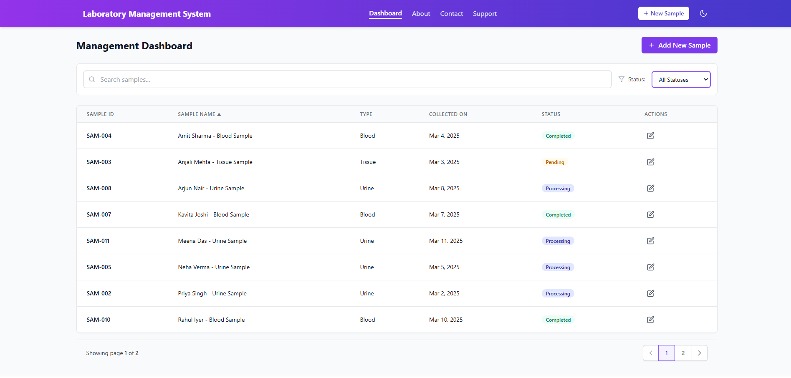 |
| **Filter by Status** | 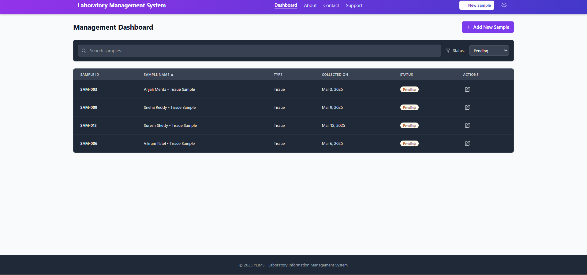 |
| **Filter by Name** | 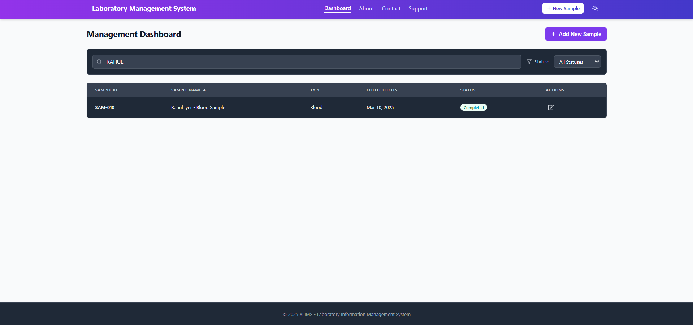 |
| **Modal (Add/Edit)** | 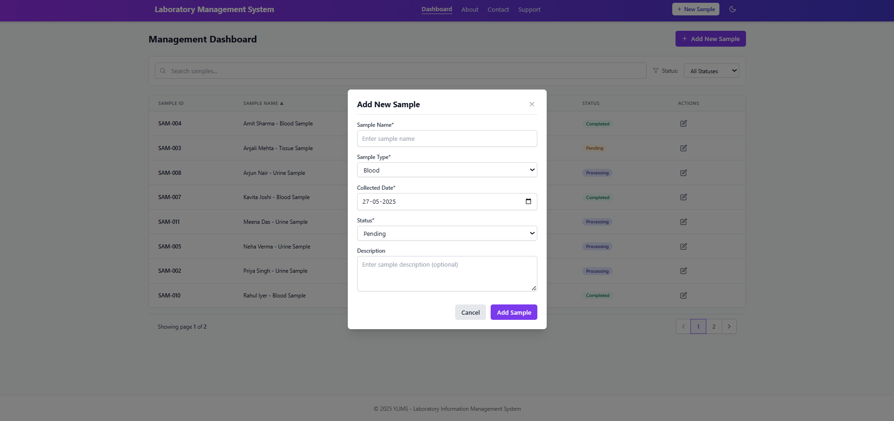 |
| **Toggled Dashboard (Dark Mode)** | 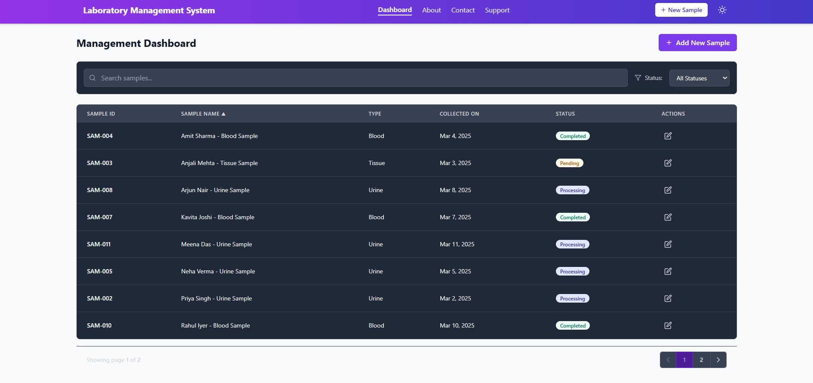 |
| **Toggled Modal (Dark Mode)** | 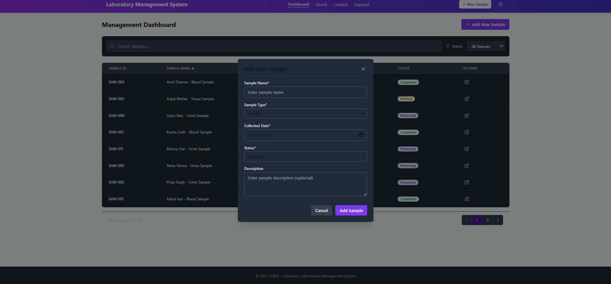 |
| **Pagination** | 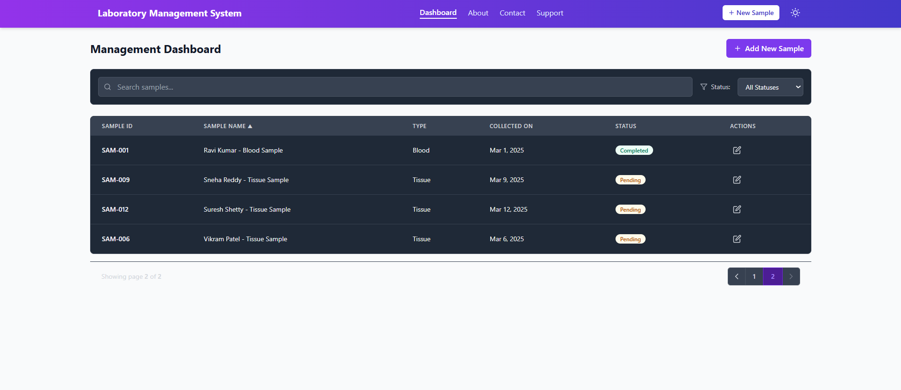 |
| **About Us** | 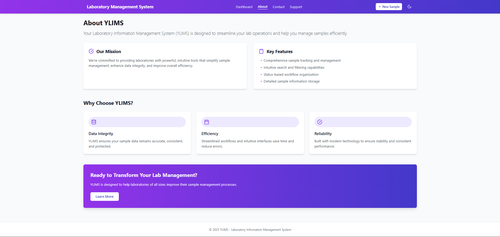 |
| **Contact** | 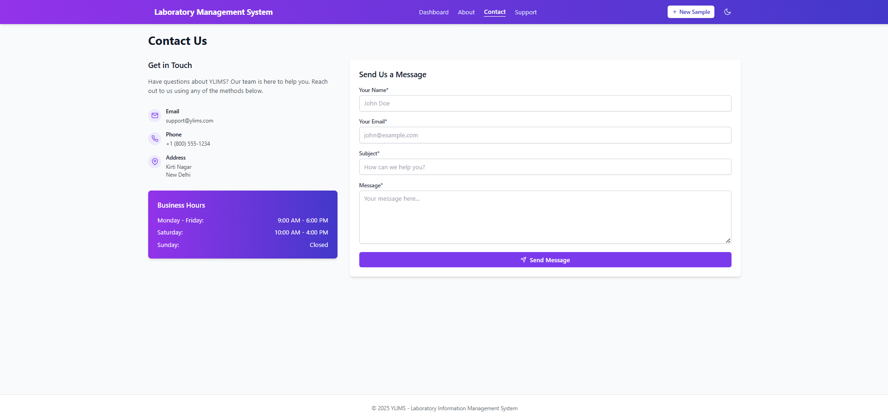 |
| **Support** | 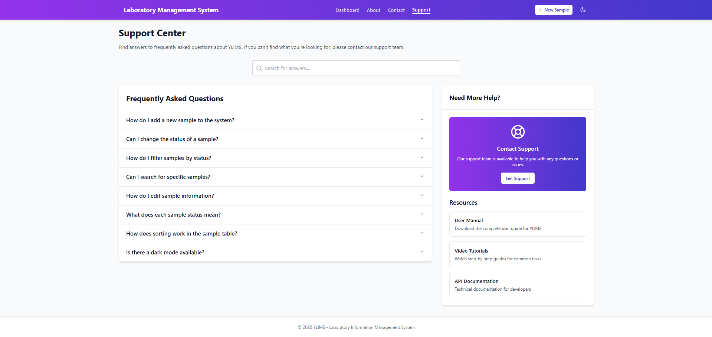 |
| **Mobile View** | 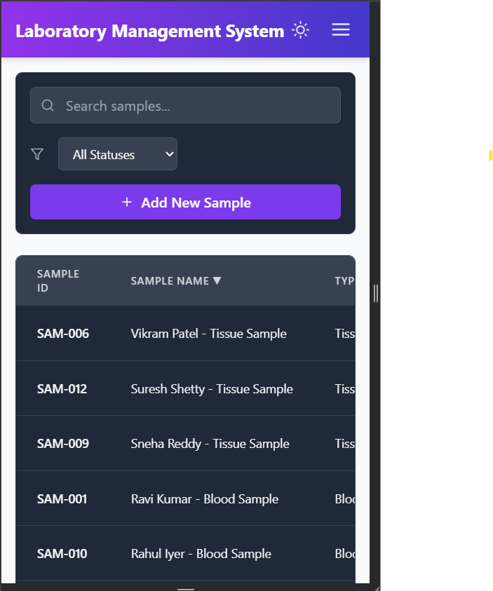 |

---

## Getting Started

### Clone the repository:
```bash
git clone https://github.com/Ambar-Goyal/ARBRO-PHARMA
